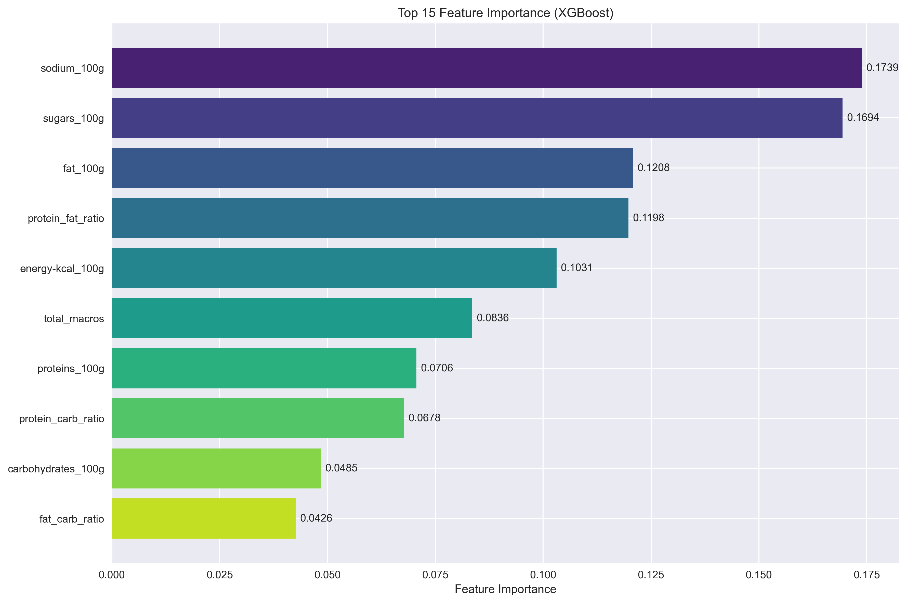
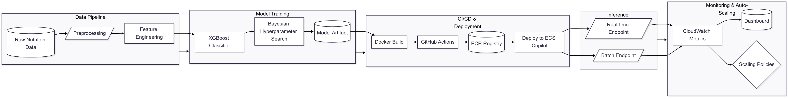

# NutriSage-Pipeline

**End-to-End ML Deployment & Monitoring on AWS**

---

## Project Overview & Business Value
NutriSage-Pipeline ingests food item nutrition data and trains a model to predict each item’s official nutrition grade (e.g., A–E). Deployed on AWS with auto-scaled inference and a custom monitoring dashboard, this project demonstrates how automated nutrition grading can streamline label generation, support consumer transparency, and enable retailers to highlight healthier options.

**Key Benefits:**
- **Regulatory compliance**: Automate nutrition-grade assignment to meet labeling standards.  
- **Consumer trust**: Provide consistent, data-driven grades to guide healthier choices.  
- **Operational efficiency**: Replace manual grading processes with a scalable ML service.

---

## Features & Highlights
- **Data Ingestion & Preprocessing**: Sample and process Parquet data from S3 with configurable scripts.  
- **Model Training**: XGBoost classifier with Bayesian hyperparameter optimization.  
- **Feature Importance**: Understand drivers of model predictions. See example below.

- **Inference Endpoints**: Batch and real-time prediction clients for flexible consumption.  
- **Auto-Scaling**: AWS Copilot (infra/) manifests manage scale-up/scale-down based on CPU and request throughput.  
- **CI/CD**: GitHub Actions automates testing, linting, image build, and deployment.  
- **Monitoring Dashboard**: Custom CloudWatch dashboard with alarms on latency, error rates, and data drift.

---

## Architecture & Pipeline

  
  

