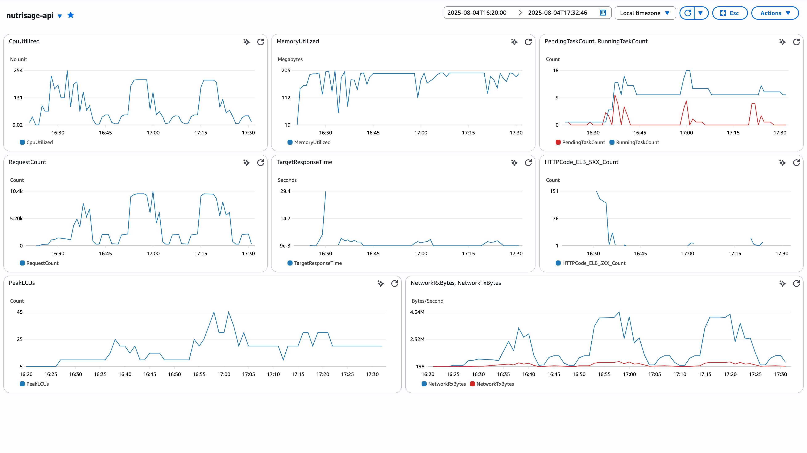

# NutriSage-Pipeline

**End-to-End ML Deployment & Monitoring on AWS**

---

## Project Overview & Business Value
NutriSage-Pipeline ingests food item nutrition data and trains a model to predict each item’s official nutrition grade (e.g., A–E). Deployed on AWS with auto-scaled inference and a custom monitoring dashboard, this project demonstrates how automated nutrition grading can streamline label generation, support consumer transparency, and enable retailers to highlight healthier options.

**Key Benefits:**
- **Regulatory compliance**: Automate nutrition-grade assignment to meet labeling standards.  
- **Consumer trust**: Provide consistent, data-driven grades to guide healthier choices.  
- **Operational efficiency**: Replace manual grading processes with a scalable ML service.

---

## Features & Highlights
- **Data Ingestion & Preprocessing**: Sample and process Parquet data from S3 with configurable scripts.  
- **Model Training**: XGBoost classifier with Bayesian hyperparameter optimization.  
- **Feature Importance**: Understand drivers of model predictions. See example below.


- **Inference Endpoints**: Batch and real-time prediction clients for flexible consumption.  
- **Auto-Scaling**: AWS Copilot (infra/) manifests manage scale-up/scale-down based on CPU and request throughput.  
- **CI/CD**: GitHub Actions automates testing, linting, image build, and deployment.  
- **Monitoring Dashboard**: Custom CloudWatch dashboard with alarms on latency, error rates, and data drift.

---

## Architecture & Pipeline


**1. Data Preprocessing**: scripts/download_and_sample.py pulls raw nutrition Parquet files, cleans missing values, encodes categories, and writes processed data.
**2. Training**: src/training.py trains an XGBoost model to predict the nutrition grade label, uses Bayesian optimization for hyperparameters, and saves the best model.
**3. Build & Deploy**:
  - Docker: Dockerfile packages the inference service.
  - GitHub Actions (.github/workflows/deploy.yml): On push to main, runs tests, builds container, and deploys via Copilot (infra/).
**4. Inference**:
  - Real-time: scripts/online_predict.py client for single-item grading.
  - Batch: scripts/send_request.py triggers batch grading requests.
**5. Monitoring**:
  - Dashboard: Definitions in dashboard/cloudwatch.json visualize CPU, latency, and data drift (e.g., shifts in average sugar or sodium levels).
  - Alarms: Trigger scaling policies and notifications on threshold breaches.

## CI/CD Details

**Tests**: pytest suite under tests/ verifies data loaders, preprocessing logic, training accuracy, and inference clients.
**Lint & Format**: flake8 and black enforced in .github/workflows/test.yml.
**Deployment**: Push to main runs deploy.yml, which:
  1. Builds and pushes Docker image to ECR.
  2. Runs copilot svc deploy (via infra/ manifests) to update the service.

## Auto-Scaling

### Copilot Autoscaling Rule (excerpt from manifest.yml)
```python
count:
  range:
    min: 1          # always keep at least one task
    max: 10         # never exceed ten tasks
    spot_from: 1    # start using Spot from 1 task (optional)
  cooldown:
    in: 5s          # wait 5 s between each scale-in step
    out: 5s         # wait 5 s between each scale-out step
  cpu_percentage: 40  # target average CPU per task
  requests: 400       # target RPS per task
exec: true             # enables ECS Exec (debugging; no effect on scaling)
network:
  connect: true        # enables Service Connect (no effect on scaling)
```
**Rule explained**
• Min/Max – caps tasks between 1 and 10, preventing over- or under-provisioning.
• Cooldown (5 s) – keeps scaling fast for a demo; you’ll see near-instant reactions.
• CPU % (40 %) – when average CPU exceeds this, ECS adds capacity.
• Requests (400 RPS) – would trigger scaling only if a single task handled > 400 RPS; in this pattern, CPU is the driver.

### Traffic Schedule (load-test client)

```python
SCHEDULE = [
    (180, 5),    #  0–3 min :   5 RPS  — light load
    (180, 50),   #  3–6 min :  50 RPS  — under thresholds
    (300, 200),  #  6–11 min: 200 RPS — CPU begins to exceed 40 %
    (300, 350),  # 11–16 min: 350 RPS — heavy CPU pressure
    (180, 5),    # 16–19 min:   5 RPS — scale-in begins
    (180, 50)    # 19–22 min:  50 RPS — back to moderate
]
```
What this does
• Phases 1–2 stay below both CPU (40 %) and request (400 RPS) targets.
• Phase 3 pushes CPU above 40 %, triggering scale-out.
• Phase 4 drives even more CPU, adding tasks up to the max.
• Phases 5–6 drop the load, causing a rapid scale-in.

### Auto-Scaling Demo



**Figure X.** ECS task count and CPU % over time as traffic ramps up and back down.

| Phase (min) | RPS | Expected Behaviour                                       | Task Count |
| :---------: | :-: | :-------------------------------------------------------:| :--------: |
| **0–3**     | 5   | Well below CPU & RPS targets                             | 1          |
| **3–6**     | 50  | Still under targets                                      | 1          |
| **6–11**    | 200 | CPU > 40 % → **scale-out**                               | \~3–5      |
| **11–16**   | 350 | More CPU pressure → further **scale-out** (capped at 10) | up to 10   |
| **16–19**   | 5   | Traffic drops → **scale-in** begins                      | ↓          |
| **19–22**   | 50  | Moderate load, CPU < 40 % → steady                       | stabilises |
